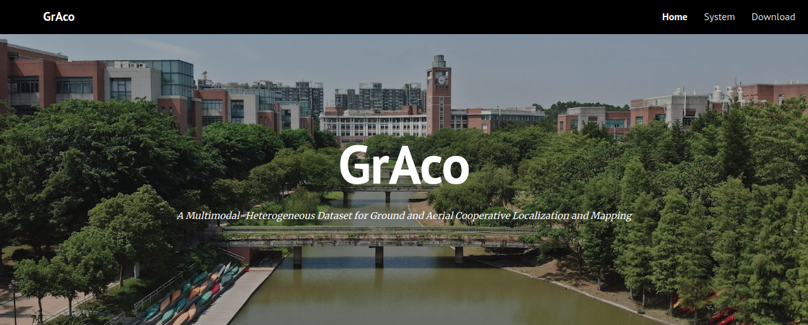
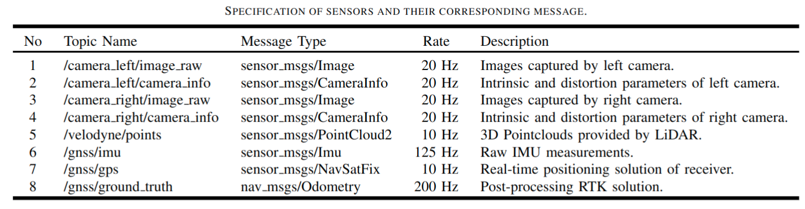
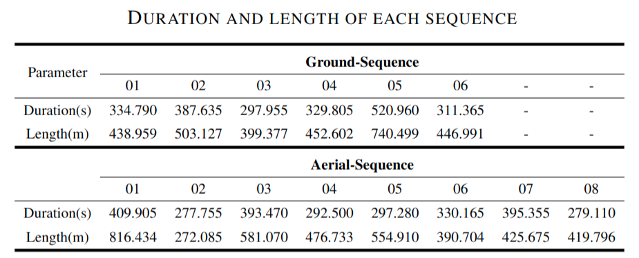
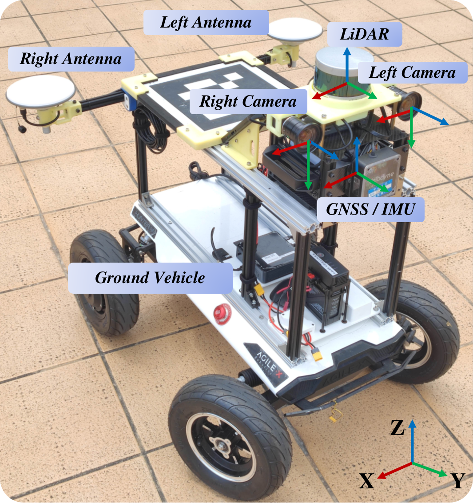
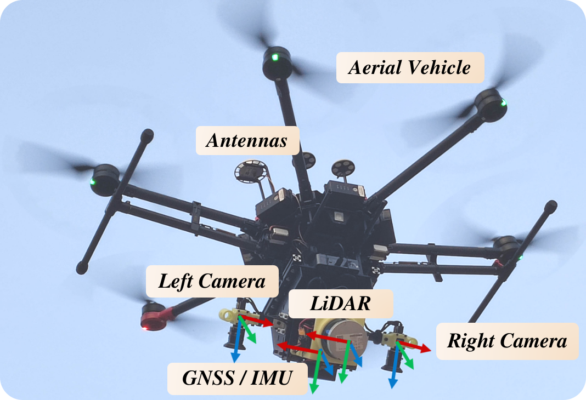

# GrAco

## A Multimodal-Heterogeneous Dataset for Ground and Aerial Cooperative Localization and Mapping

<div align="center">
    
</div>

***GrAco***, is a dataset that includes both ground and aerial views.  The main characteristics of our dataset are as follows:

- **Multimodal-Heterogeneous data:** An available and completely public dataset for C-SLAM research. It includes multi-modal data (inertial measurement unit (IMU), cameras, Light Detection and Ranging (LiDAR), and Global Positioning System (GPS)) in large-scale urban scenes collected by a fleet of ground and aerial vehicles.
- **High precision:** sensors are synchronized with millisecond-level and well calibrated. Centimeter-level ground truth localization obtained from RTK GNSS is provided.
- **Loop closures between robots:** Encounters among robots are designed during data collection, providing useful scenarios to the C-SLAM research.

**Here is the download page provided for convenience. For more details, please visit our dataset website: https://sites.google.com/view/graco-dataset.** 

**Contributors**

[Yilin Zhu](https://github.com/inntoy), [Yang Kong](https://github.com/JoenHune), [Yingrui Jie](https://github.com/jieyr3Rui), Shiyou Xu and [Hui Cheng](https://cse.sysu.edu.cn/content/2504) from [SYSU RAPID Lab](http://lab.sysu-robotics.com/index.html).

If our work has helped you, please cite:

```
@article{DBLP:journals/ral/ZhuKJXC23,
  author    = {Yilin Zhu and
               Yang Kong and
               Yingrui Jie and
               Shiyou Xu and
               Hui Cheng},
  title     = {GRACO: A Multimodal Dataset for Ground and Aerial Cooperative Localization and Mapping},
  journal   = {{IEEE} Robotics Autom. Lett.},
  volume    = {8},
  number    = {2},
  pages     = {966--973},
  year      = {2023}
}
```

## **Inedx**

1. [Data format](#data_format)
2. [Download](#download)
   - [Ground sequence](#Ground_sequence)
   - [Aerial sequence](#Aerial_sequence)

<a name="data_format"></a>

## 1. Data format

We provide data in rosbag file format (ROS1 and ROS2 format), and sift out six ground sequences and eight aerialsequences. In addition, we provide a relatively small sample sequence for ground and aerial respectively. Here are topics (ROS1 format) that each bag has.

<div align="center">
    
</div>

<a name="download"></a>

## 2. Download

We provided a total of 6 ground sequences and 8 air sequences. Acquisition equipment and sequences are shown in the corresponding pictures. The duration and length of each sequence are shown below.

<div align="center">
    
</div>

<a name="Ground_sequence"></a>

### 1. Ground sequence

<div align="left">
    
    
</div>


|       Sequence        |                           ROS1 bag                           |                           ROS2 bag                           |                      Ground truth file                       |                       Calibration file                       |
| :-------------------: | :----------------------------------------------------------: | :----------------------------------------------------------: | :----------------------------------------------------------: | :----------------------------------------------------------: |
| sample-ground (3.0GB) | [√](https://1drv.ms/u/s!AmSRwVTuK0YFgRk-P5YAqh9zYEQ_?e=Lr3sy2) |                              -                               | [√](https://1drv.ms/t/s!AmSRwVTuK0YFgQ87Vcks-OtL1Mb6?e=mLlBrw) | [√](https://drive.google.com/drive/folders/13b1d9AEltUnWRDJcyqAhQWNj9QaRDJuH?usp=sharing) |
|  ground-01 (23.9GB)   | [√](https://1drv.ms/u/s!AmSRwVTuK0YFggmypED_MUKEDpfZ?e=VicCqV) | [√](https://1drv.ms/u/s!AmSRwVTuK0YFgSbH3kdf15zaSznb?e=JGzTsJ) | [√](https://1drv.ms/t/s!AmSRwVTuK0YFgRAzpAwjACj_Xyed?e=YfMubP) | [√](https://drive.google.com/drive/folders/13b1d9AEltUnWRDJcyqAhQWNj9QaRDJuH?usp=sharing) |
|  ground-02 (27.7GB)   | [√](https://1drv.ms/u/s!AmSRwVTuK0YFggp9_HXD1kaKRHQy?e=u8h39O) | [√](https://1drv.ms/u/s!AmSRwVTuK0YFgScOp6scVJAmRNwv?e=GaCmKq) | [√](https://1drv.ms/t/s!AmSRwVTuK0YFgRPUlncQ9tVZfAvN?e=lPRfnN) | [√](https://drive.google.com/drive/folders/13b1d9AEltUnWRDJcyqAhQWNj9QaRDJuH?usp=sharing) |
|  ground-03 (21.3GB)   | [√](https://1drv.ms/u/s!AmSRwVTuK0YFgguDgDaxleIPkoLF?e=W6n27a) | [√](https://1drv.ms/u/s!AmSRwVTuK0YFgSnWnpUciPZvYpMI?e=M1NvVn) | [√](https://1drv.ms/t/s!AmSRwVTuK0YFgRHqQKruk5DzfDBG?e=iUQt2D) | [√](https://drive.google.com/drive/folders/13b1d9AEltUnWRDJcyqAhQWNj9QaRDJuH?usp=sharing) |
|  ground-04 (23.6GB)   | [√](https://1drv.ms/u/s!AmSRwVTuK0YFggxkXss3l-uIx076?e=x4aBPH) | [√](https://1drv.ms/u/s!AmSRwVTuK0YFgSuVX-ioN9x2Sbg6?e=Ce7PQY) | [√](https://1drv.ms/t/s!AmSRwVTuK0YFgRKDx5mN_uB78fW-?e=LHuVdc) | [√](https://drive.google.com/drive/folders/13b1d9AEltUnWRDJcyqAhQWNj9QaRDJuH?usp=sharing) |
|  ground-05 (37.3GB)   | [√](https://1drv.ms/u/s!AmSRwVTuK0YFgg7YjRGkYoNaIx3_?e=9LxGw9) | [√](https://1drv.ms/u/s!AmSRwVTuK0YFgS0G1K0Jfs2uWOxR?e=f1AmpS) | [√](https://1drv.ms/t/s!AmSRwVTuK0YFgRUHAoAm5oiR3UJV?e=mSAdSY) | [√](https://drive.google.com/drive/folders/13b1d9AEltUnWRDJcyqAhQWNj9QaRDJuH?usp=sharing) |
|  ground-06 (22.3GB)   | [√](https://1drv.ms/u/s!AmSRwVTuK0YFgg2pL96oowwx_7wy?e=L74jFc) | [√](https://1drv.ms/u/s!AmSRwVTuK0YFgS_hGmLnKjyUlFcm?e=s0jg2L) | [√](https://1drv.ms/t/s!AmSRwVTuK0YFgRSzMAfUW2Txe-W2?e=JXKub3) | [√](https://drive.google.com/drive/folders/13b1d9AEltUnWRDJcyqAhQWNj9QaRDJuH?usp=sharing) |


<a name="Aerial_sequence"></a>

### 2. Aerial sequence

<div align="left">
    
    
</div>

|        Sequence        |                           ROS1 bag                           |                           ROS2 bag                           |                      Ground truth file                       |                       Calibration file                       |
| :--------------------: | :----------------------------------------------------------: | :----------------------------------------------------------: | :----------------------------------------------------------: | :----------------------------------------------------------: |
| sample-aerial (2.9GB)  | [√](https://1drv.ms/u/s!AmSRwVTuK0YFgRZ-lzKh2yDwsLDh?e=Tx8kxg) |                              -                               | [√](https://1drv.ms/t/s!AmSRwVTuK0YFgQaRN-KiAJ5ysrK_?e=wx679n) | [√](https://drive.google.com/drive/folders/1rb0_X_XrptNqZRw4EaUC6OSfE3PEeM0_?usp=sharing) |
| aerial-01-40m (29.3GB) | [√](https://1drv.ms/u/s!AmSRwVTuK0YFghGt-5acB5oRN7qe?e=Xqvdtg) | [√](https://1drv.ms/u/s!AmSRwVTuK0YFgTmNGAh-igOfDQ5t?e=HWGAVE) | [√](https://1drv.ms/t/s!AmSRwVTuK0YFgQwSZorj_bv5Esua?e=Cw19Ge) | [√](https://drive.google.com/drive/folders/1rb0_X_XrptNqZRw4EaUC6OSfE3PEeM0_?usp=sharing) |
| aerial-02-20m (19.9GB) | [√](https://1drv.ms/u/s!AmSRwVTuK0YFghCJYBIDKnlbFKJr?e=ru5rLb) | [√](https://1drv.ms/u/s!AmSRwVTuK0YFgTqvW5fF39LTCaoL?e=xHG77y) | [√](https://1drv.ms/t/s!AmSRwVTuK0YFgQe2n125icr3POVJ?e=zCEJMI) | [√](https://drive.google.com/drive/folders/1rb0_X_XrptNqZRw4EaUC6OSfE3PEeM0_?usp=sharing) |
| aerial-03-20m (28.1GB) |    [√](https://1drv.ms/u/s!AmSRwVTuK0YFghTdEcXgNHfModwZ)     | [√](https://1drv.ms/u/s!AmSRwVTuK0YFgT2UO7g1S7LTTsi9?e=UmQOZC) | [√](https://1drv.ms/t/s!AmSRwVTuK0YFgQkz_SuCwgsgnL8T?e=TXqU39) | [√](https://drive.google.com/drive/folders/1rb0_X_XrptNqZRw4EaUC6OSfE3PEeM0_?usp=sharing) |
| aerial-04-40m (20.9GB) |    [√](https://1drv.ms/u/s!AmSRwVTuK0YFghJimpqjSBAQl9da)     | [√](https://1drv.ms/u/s!AmSRwVTuK0YFgXYirehex2HP5TGv?e=Vj6RjE) | [√](https://1drv.ms/t/s!AmSRwVTuK0YFgQhpxiJpX_lCaxeO?e=xb4yj5) | [√](https://drive.google.com/drive/folders/1rb0_X_XrptNqZRw4EaUC6OSfE3PEeM0_?usp=sharing) |
| aerial-05-40m (21.3GB) | [√](https://1drv.ms/u/s!AmSRwVTuK0YFghP1t9SleeMZwiUc?e=whL7XA) | [√](https://1drv.ms/u/s!AmSRwVTuK0YFgXcr4Z3-XfuSmhO_?e=bzzNk3) | [√](https://1drv.ms/t/s!AmSRwVTuK0YFgQqEJWHP9E9OdjGq?e=U8PbZR) | [√](https://drive.google.com/drive/folders/1rb0_X_XrptNqZRw4EaUC6OSfE3PEeM0_?usp=sharing) |
| aerial-06-20m (23.6GB) | [√](https://1drv.ms/u/s!AmSRwVTuK0YFghZzfuO9LalmapEZ?e=E2oxAF) | [√](https://1drv.ms/u/s!AmSRwVTuK0YFgXnFWknBk0BkTkpP?e=3WK0Nn) | [√](https://1drv.ms/t/s!AmSRwVTuK0YFgQskW9qZ5dsKrl2E?e=gOqcct) | [√](https://drive.google.com/drive/folders/1rb0_X_XrptNqZRw4EaUC6OSfE3PEeM0_?usp=sharing) |
| aerial-07-25m (28.3GB) |    [√](https://1drv.ms/u/s!AmSRwVTuK0YFghd4O5OzmrCwPlBv)     | [√](https://1drv.ms/u/s!AmSRwVTuK0YFgXspbVDGNyN-87od?e=GGu46U) | [√](https://1drv.ms/t/s!AmSRwVTuK0YFgQ19nbH5bE1aBafv?e=vzqKGs) | [√](https://drive.google.com/drive/folders/1rb0_X_XrptNqZRw4EaUC6OSfE3PEeM0_?usp=sharing) |
| aerial-08-25m (19.9GB) |    [√](https://1drv.ms/u/s!AmSRwVTuK0YFghXEVnlm3vQv15vt)     | [√](https://1drv.ms/u/s!AmSRwVTuK0YFgX1V2orIb_M2p0z7?e=MqHXbv) | [√](https://1drv.ms/t/s!AmSRwVTuK0YFgQ6NfsTFMwCv-P16?e=NV7B4y) | [√](https://drive.google.com/drive/folders/1rb0_X_XrptNqZRw4EaUC6OSfE3PEeM0_?usp=sharing) |

The suffix in the name represents the flight altitude.
