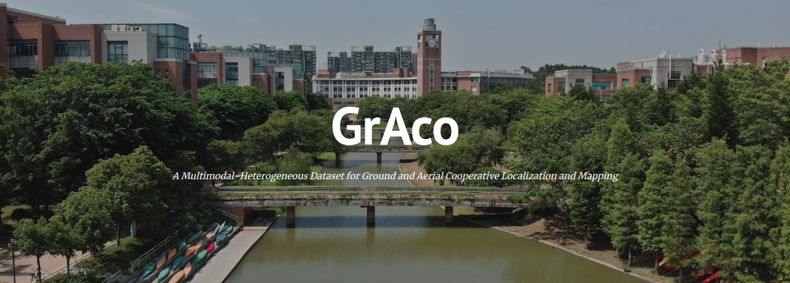

# GrAco

## A Multimodal-Heterogeneous Dataset for Ground and Aerial Cooperative Localization and Mapping

    

***GrAco***, is a dataset that includes both ground and aerial views.  The main characteristics of our dataset are as follows:

- **Multimodal-Heterogeneous data:** An available and completely public dataset for C-SLAM research. It includes multi-modal data (inertial measurement unit (IMU), cameras, Light Detection and Ranging (LiDAR), and Global Positioning System (GPS)) in large-scale urban scenes collected by a fleet of ground and aerial vehicles.
- **High precision:** sensors are synchronized with millisecond-level and well calibrated. Centimeter-level ground truth localization obtained from RTK GNSS is provided.
- **Loop closures between robots:** Encounters among robots are designed during data collection, providing useful scenarios to the C-SLAM research.

**Here is the download page provided for convenience. For more details, please visit our dataset website: https://sites.google.com/view/graco-dataset.** 

**Contributors**

[Yilin Zhu](https://github.com/inntoy), [Yang Kong](https://github.com/JoenHune), [Yingrui Jie](https://github.com/jieyr3Rui), Shiyou Xu and [Hui Cheng](https://cse.sysu.edu.cn/content/2504) from [SYSU RAPID Lab](http://lab.sysu-robotics.com/index.html).

## **Inedx**

1. [Data format](#data_format)
2. [Download](#download)
   - [Ground sequence](#Ground_sequence)
   - [Aerial sequence](#Aerial_sequence)

## 1. Data format

We provide data in rosbag file (ROS1 and ROS2 format). In addition, ROS1 bag uses [lz4](http://wiki.ros.org/rosbag/Commandline#filter) compression. If you need decompress, you can use the command `rosbag decompress *.bag` (* is the bag name) on a computer with a ROS1 environment. Here are topics (ROS1 format) that each bag has.

    

## 2. Download

We provided a total of 6 ground sequences and 8 air sequences. Acquisition equipment and sequences are shown in the corresponding pictures. The duration and length of each sequence are shown below.

    

### 1. Ground sequence

    
    

|       Sequence        |                           ROS1 bag                           |                           ROS2 bag                           |                      Ground truth file                       |                       Calibration file                       |
| :-------------------: | :----------------------------------------------------------: | :----------------------------------------------------------: | :----------------------------------------------------------: | :----------------------------------------------------------: |
| sample-ground (2.6GB) | [√](https://1drv.ms/u/s!AmSRwVTuK0YFgRi7vCfCBHRswXGt?e=qVMb06) |                              -                               | [√](https://1drv.ms/t/s!AmSRwVTuK0YFgQ87Vcks-OtL1Mb6?e=mLlBrw) | [√](https://drive.google.com/drive/folders/13b1d9AEltUnWRDJcyqAhQWNj9QaRDJuH?usp=sharing) |
|  ground-01 (21.1GB)   | [√](https://1drv.ms/u/s!AmSRwVTuK0YFd2jkmKmeNET_DRM?e=hg5gcH) | [√](https://1drv.ms/u/s!AmSRwVTuK0YFgSbH3kdf15zaSznb?e=JGzTsJ) | [√](https://1drv.ms/t/s!AmSRwVTuK0YFgRAzpAwjACj_Xyed?e=YfMubP) | [√](https://drive.google.com/drive/folders/13b1d9AEltUnWRDJcyqAhQWNj9QaRDJuH?usp=sharing) |
|  ground-02 (25.8GB)   | [√](https://1drv.ms/u/s!AmSRwVTuK0YFfHvxfafEcCrjByk?e=KFIvQa) | [√](https://1drv.ms/u/s!AmSRwVTuK0YFgScOp6scVJAmRNwv?e=GaCmKq) | [√](https://1drv.ms/t/s!AmSRwVTuK0YFgRPUlncQ9tVZfAvN?e=lPRfnN) | [√](https://drive.google.com/drive/folders/13b1d9AEltUnWRDJcyqAhQWNj9QaRDJuH?usp=sharing) |
|  ground-03 (19.0GB)   | [√](https://1drv.ms/u/s!AmSRwVTuK0YFe9Lrd0y0Wv1c7Ms?e=hjY11Z) | [√](https://1drv.ms/u/s!AmSRwVTuK0YFgSnWnpUciPZvYpMI?e=M1NvVn) | [√](https://1drv.ms/t/s!AmSRwVTuK0YFgRHqQKruk5DzfDBG?e=iUQt2D) | [√](https://drive.google.com/drive/folders/13b1d9AEltUnWRDJcyqAhQWNj9QaRDJuH?usp=sharing) |
|  ground-04 (20.2GB)   | [√](https://1drv.ms/u/s!AmSRwVTuK0YFenN0U0skN5IVAYU?e=ZsfRl6) | [√](https://1drv.ms/u/s!AmSRwVTuK0YFgSuVX-ioN9x2Sbg6?e=Ce7PQY) | [√](https://1drv.ms/t/s!AmSRwVTuK0YFgRKDx5mN_uB78fW-?e=LHuVdc) | [√](https://drive.google.com/drive/folders/13b1d9AEltUnWRDJcyqAhQWNj9QaRDJuH?usp=sharing) |
|  ground-05 (32.4GB)   | [√](https://1drv.ms/u/s!AmSRwVTuK0YFeVwyWXsRCmuBnx8?e=deYYg5) | [√](https://1drv.ms/u/s!AmSRwVTuK0YFgS0G1K0Jfs2uWOxR?e=f1AmpS) | [√](https://1drv.ms/t/s!AmSRwVTuK0YFgRUHAoAm5oiR3UJV?e=mSAdSY) | [√](https://drive.google.com/drive/folders/13b1d9AEltUnWRDJcyqAhQWNj9QaRDJuH?usp=sharing) |
|  ground-06 (20.0GB)   | [√](https://1drv.ms/u/s!AmSRwVTuK0YFeOM2VzrBsxuhI-A?e=NmzRpY) | [√](https://1drv.ms/u/s!AmSRwVTuK0YFgS_hGmLnKjyUlFcm?e=s0jg2L) | [√](https://1drv.ms/t/s!AmSRwVTuK0YFgRSzMAfUW2Txe-W2?e=JXKub3) | [√](https://drive.google.com/drive/folders/13b1d9AEltUnWRDJcyqAhQWNj9QaRDJuH?usp=sharing) |

### 2. Aerial sequence

    
    

|        Sequence        |                           ROS1 bag                           |                           ROS2 bag                           |                      Ground truth file                       |                       Calibration file                       |
| :--------------------: | :----------------------------------------------------------: | :----------------------------------------------------------: | :----------------------------------------------------------: | :----------------------------------------------------------: |
| sample-aerial (2.4GB)  | [√](https://1drv.ms/u/s!AmSRwVTuK0YFgRf-ZI0qxeEWAM_s?e=kYDcw7) |                              -                               | [√](https://1drv.ms/t/s!AmSRwVTuK0YFgQaRN-KiAJ5ysrK_?e=wx679n) | [√](https://drive.google.com/drive/folders/1rb0_X_XrptNqZRw4EaUC6OSfE3PEeM0_?usp=sharing) |
| aerial-01-40m (29.2GB) | [√](https://1drv.ms/u/s!AmSRwVTuK0YFf4rylJnMog1ReF4?e=ce6beb) | [√](https://1drv.ms/u/s!AmSRwVTuK0YFgTmNGAh-igOfDQ5t?e=HWGAVE) | [√](https://1drv.ms/t/s!AmSRwVTuK0YFgQwSZorj_bv5Esua?e=Cw19Ge) | [√](https://drive.google.com/drive/folders/1rb0_X_XrptNqZRw4EaUC6OSfE3PEeM0_?usp=sharing) |
| aerial-02-20m (17.3GB) | [√](https://1drv.ms/u/s!AmSRwVTuK0YFfliSObYs8RBVhGA?e=OT8bev) | [√](https://1drv.ms/u/s!AmSRwVTuK0YFgTqvW5fF39LTCaoL?e=xHG77y) | [√](https://1drv.ms/t/s!AmSRwVTuK0YFgQe2n125icr3POVJ?e=zCEJMI) | [√](https://drive.google.com/drive/folders/1rb0_X_XrptNqZRw4EaUC6OSfE3PEeM0_?usp=sharing) |
| aerial-03-20m (27.6GB) | [√](https://1drv.ms/u/s!AmSRwVTuK0YFgQB9VMM3pBqNnLz-?e=NW7MJb) | [√](https://1drv.ms/u/s!AmSRwVTuK0YFgT2UO7g1S7LTTsi9?e=UmQOZC) | [√](https://1drv.ms/t/s!AmSRwVTuK0YFgQkz_SuCwgsgnL8T?e=TXqU39) | [√](https://drive.google.com/drive/folders/1rb0_X_XrptNqZRw4EaUC6OSfE3PEeM0_?usp=sharing) |
| aerial-04-40m (20.9GB) | [√](https://1drv.ms/u/s!AmSRwVTuK0YFgQG73lrQZeGc6yiW?e=M2w7R1) | [√](https://1drv.ms/u/s!AmSRwVTuK0YFgXYirehex2HP5TGv?e=Vj6RjE) | [√](https://1drv.ms/t/s!AmSRwVTuK0YFgQhpxiJpX_lCaxeO?e=xb4yj5) | [√](https://drive.google.com/drive/folders/1rb0_X_XrptNqZRw4EaUC6OSfE3PEeM0_?usp=sharing) |
| aerial-05-40m (21.0GB) | [√](https://1drv.ms/u/s!AmSRwVTuK0YFgQI0yy6Mwuv_pcSs?e=kFAmpg) | [√](https://1drv.ms/u/s!AmSRwVTuK0YFgXcr4Z3-XfuSmhO_?e=bzzNk3) | [√](https://1drv.ms/t/s!AmSRwVTuK0YFgQqEJWHP9E9OdjGq?e=U8PbZR) | [√](https://drive.google.com/drive/folders/1rb0_X_XrptNqZRw4EaUC6OSfE3PEeM0_?usp=sharing) |
| aerial-06-20m (22.9GB) | [√](https://1drv.ms/u/s!AmSRwVTuK0YFgQRQIkwE63oZ9H25?e=muzKin) | [√](https://1drv.ms/u/s!AmSRwVTuK0YFgXnFWknBk0BkTkpP?e=3WK0Nn) | [√](https://1drv.ms/t/s!AmSRwVTuK0YFgQskW9qZ5dsKrl2E?e=gOqcct) | [√](https://drive.google.com/drive/folders/1rb0_X_XrptNqZRw4EaUC6OSfE3PEeM0_?usp=sharing) |
| aerial-07-25m (27.3GB) | [√](https://1drv.ms/u/s!AmSRwVTuK0YFgQWmRKayfsotpnJv?e=PUBerR) | [√](https://1drv.ms/u/s!AmSRwVTuK0YFgXspbVDGNyN-87od?e=GGu46U) | [√](https://1drv.ms/t/s!AmSRwVTuK0YFgQ19nbH5bE1aBafv?e=vzqKGs) | [√](https://drive.google.com/drive/folders/1rb0_X_XrptNqZRw4EaUC6OSfE3PEeM0_?usp=sharing) |
| aerial-08-25m (18.8GB) | [√](https://1drv.ms/u/s!AmSRwVTuK0YFgQOPtZ1Z1FeKPvs7?e=u00PRq) | [√](https://1drv.ms/u/s!AmSRwVTuK0YFgX1V2orIb_M2p0z7?e=MqHXbv) | [√](https://1drv.ms/t/s!AmSRwVTuK0YFgQ6NfsTFMwCv-P16?e=NV7B4y) | [√](https://drive.google.com/drive/folders/1rb0_X_XrptNqZRw4EaUC6OSfE3PEeM0_?usp=sharing) |

The suffix in the name represents the flight altitude.
